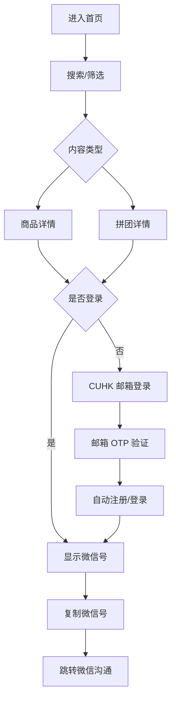
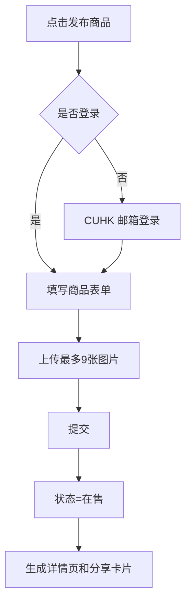
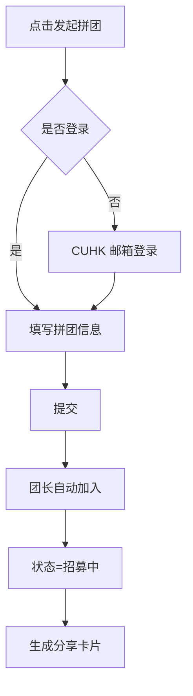
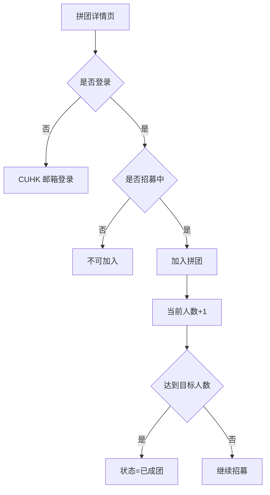
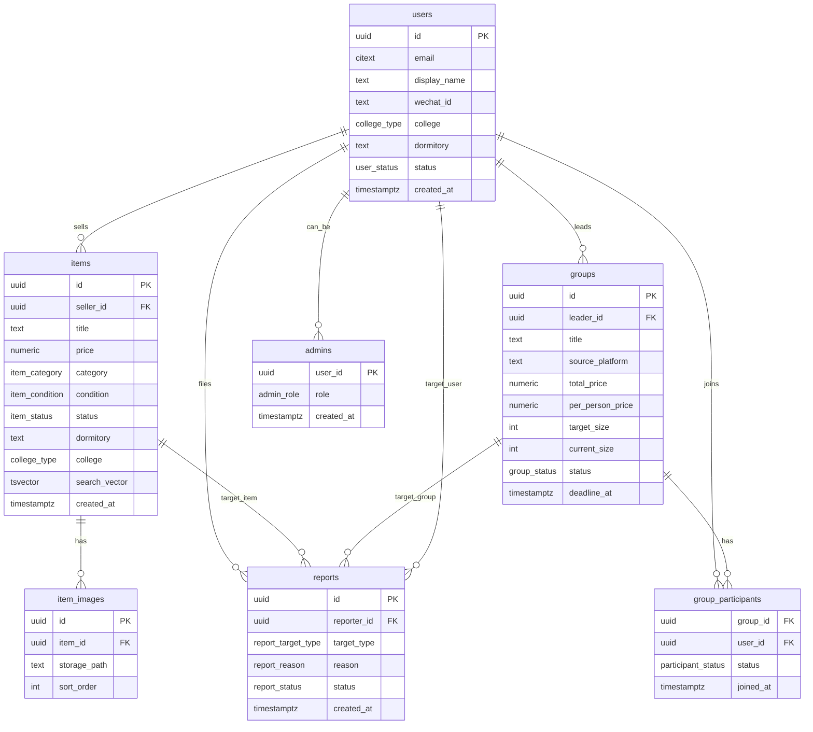

# CUHK 校园交易与资源共享社区 PRD

## 1. 完整 PRD

### 产品定位

CUHK Campus Marketplace 是面向香港中文大学学生的校园交易与资源共享社区。产品不做校巴、校历、课表等校园工具功能；首页默认展示商品流和拼团流。

核心原则：

- 微信群负责传播。
- 平台负责沉淀。
- 信息必须可搜索、可筛选、可长期留存。
- 第一版只做交易信息和拼团组织，不做支付、不做聊天、不做担保。

### 背景问题

- 二手信息散落在不同微信群。
- 宿舍内部可能存在多个群，信息重复且难找。
- 不同宿舍之间信息不互通。
- 商品很快被聊天记录刷掉。
- 拼团依赖接龙和私聊，人数、截止时间、交收地点不清晰。

### MVP 目标

1. 让学生能在 30 秒内发布一个二手商品。
2. 让学生能按宿舍、书院、分类快速找到商品。
3. 让拼团信息有固定详情页和人数状态。
4. 让每个商品和拼团都能生成微信群分享卡片。
5. 用 CUHK 邮箱验证建立基本准入门槛。

### 核心用户

- 卖家：毕业、搬宿、换设备，需要快速出闲置。
- 买家：想低价买宿舍用品、教材、电子产品。
- 团长：组织 Costco、山姆、IKEA、淘宝集运、京东、外卖、日用品分摊。
- 团员：想加入已有拼团，减少沟通成本。
- 管理员：处理诈骗、虚假商品、骚扰、不当内容举报。

### 成功指标

MVP 上线后前 4 周重点看：

- CUHK 邮箱验证用户数。
- 发布商品数。
- 发布拼团数。
- 商品详情页微信号复制次数。
- 拼团加入次数。
- 每个商品/拼团的分享次数。
- 举报处理时长。

### 非目标

第一版明确不做：

- 在线支付。
- 担保交易。
- 信用积分。
- 评价系统。
- 黑名单。
- 聊天系统。
- 自动分账。
- 物流系统。
- 校巴、课表、校历、地图首页。

### 模块 1：二手交易

用户能力：

- 发布商品。
- 浏览商品。
- 搜索商品。
- 查看详情。
- 登录后查看并复制卖家微信号。
- 编辑自己的商品。
- 下架自己的商品。
- 标记自己的商品为已售。
- 举报商品。

商品字段：

| 字段 | 说明 |
| --- | --- |
| 标题 | 必填，最多 80 字 |
| 描述 | 必填，最多 2000 字 |
| 价格 | 必填，HKD，允许 0 |
| 分类 | 电子产品、家具、宿舍用品、厨房用品、教材、衣物、运动用品、其他 |
| 成色 | 全新、几乎全新、良好、可用、有瑕疵 |
| 图片 | 最多 9 张 |
| 宿舍 | 例如 23座、56座、39座、研究生宿舍 |
| 书院 | 崇基、新亚、联合、逸夫、晨兴、善衡、敬文、伍宜孙、和声、研究生、其他 |
| 交收地点 | 自由文本 |
| 发布时间 | 系统生成 |
| 状态 | 在售、已预订、已售出、已下架 |

### 模块 2：拼团

典型场景：

- Costco。
- 山姆。
- IKEA。
- 淘宝集运。
- 京东凑单。
- 外卖拼单。
- 日用品分摊。

用户能力：

- 发起拼团。
- 加入拼团。
- 退出拼团。
- 查看拼团详情。
- 登录后查看并复制团长微信号。
- 联系团长。
- 举报拼团。

拼团字段：

| 字段 | 说明 |
| --- | --- |
| 标题 | 必填，最多 80 字 |
| 描述 | 必填，最多 2000 字 |
| 来源平台 | Costco、Sam's Club、IKEA、淘宝、京东、外卖、其他 |
| 总价 | HKD，可选 |
| 人均价格 | HKD，可选 |
| 目标人数 | 必填，最少 2 |
| 当前人数 | 系统维护 |
| 截止时间 | 必填 |
| 宿舍 | 可选筛选维度 |
| 书院 | 可选筛选维度 |
| 交收地点 | 必填 |
| 状态 | 招募中、已成团、已截止、已取消 |

### 用户体系

游客无需登录：

- 可以浏览商品。
- 可以浏览拼团。
- 可以搜索。
- 可以查看详情页基础信息。
- 不能查看微信号。
- 不能发布、加入、举报。

注册用户：

- 使用 CUHK 邮箱验证注册。
- 支持 `@link.cuhk.edu.hk` 与 `@cuhk.edu.hk`。
- 不需要身份证、学生证照片、人工审核。
- 登录后可查看联系方式、发布商品、发起拼团、加入拼团、举报内容。

### 联系方式规则

不公开展示微信号给游客。

商品详情页：

- 游客看到「登录后查看联系方式」和「CUHK 邮箱登录」按钮。
- 注册用户看到微信号和「复制微信号」按钮。

拼团详情页：

- 与商品详情页同样逻辑。

联系流程：

```text
点击商品/拼团
↓
查看详情
↓
CUHK 邮箱登录
↓
复制微信号
↓
跳转微信沟通
```

### 分享机制

每个商品和拼团都生成分享卡片数据。

商品分享示例：

```text
Dell 27寸显示器
500 HKD
伍宜孙56座

点击查看详情
```

拼团分享示例：

```text
Costco纸巾拼团
当前：4/6
截止：今晚12点

点击加入
```

### 举报系统

用户可举报：

- 诈骗。
- 虚假商品。
- 骚扰。
- 不当内容。

管理员后台支持：

- 查看举报列表。
- 按状态筛选。
- 查看被举报内容。
- 标记处理中、已处理、驳回。
- 必要时下架商品或取消拼团。

## 2. 用户流程图

### 浏览与联系



### 发布商品



### 发起拼团



### 加入拼团



## 3. 页面结构图

```text
首页
├── 顶部搜索
├── 类型切换：全部 / 二手 / 拼团
├── 筛选：宿舍 / 书院 / 分类 / 最新发布
├── 最新商品列表
├── 最新拼团列表
└── 底部导航
    ├── 首页
    ├── 发布
    ├── 我的
    └── 登录/账号

商品详情
├── 图片轮播
├── 标题、价格、状态
├── 分类、成色、宿舍、书院、交收地点
├── 描述
├── 联系卖家区域
├── 分享按钮
└── 举报入口

拼团详情
├── 标题、状态
├── 当前人数 / 目标人数
├── 截止时间
├── 平台、价格、交收地点
├── 描述
├── 加入/退出拼团按钮
├── 联系团长区域
├── 分享按钮
└── 举报入口

我的
├── 账号信息
├── 我的商品
├── 我的拼团
├── 我加入的拼团
└── 退出登录

管理员后台 Web
├── Overview
├── Items
├── Groups
├── Reports
└── Users
```

## 4. 数据库 ER 图



## 5. API 设计

API 作为 Next.js BFF，Web 和小程序共用。生产环境应部署到 HTTPS 域名，并在微信公众平台配置 request 合法域名。

### Auth

`POST /api/auth/request-otp`

Request:

```json
{ "email": "student@link.cuhk.edu.hk" }
```

Response:

```json
{ "ok": true }
```

规则：

- 只允许 `@link.cuhk.edu.hk` 和 `@cuhk.edu.hk`。
- 调用 Supabase Auth email OTP。

`POST /api/auth/verify-otp`

Request:

```json
{ "email": "student@link.cuhk.edu.hk", "token": "123456" }
```

Response:

```json
{
  "ok": true,
  "session": { "access_token": "..." },
  "user": { "id": "...", "email": "student@link.cuhk.edu.hk" }
}
```

### Items

`GET /api/items`

Query:

- `q`
- `category`
- `dormitory`
- `college`
- `status`
- `limit`
- `cursor`

Response:

```json
{
  "data": [
    {
      "id": "uuid",
      "title": "Dell 27寸显示器",
      "price": 500,
      "category": "electronics",
      "condition": "good",
      "status": "available",
      "dormitory": "56座",
      "college": "wu_yee_sun",
      "handover_location": "伍宜孙56座大堂",
      "cover_image_url": "https://...",
      "created_at": "2026-06-22T08:00:00Z"
    }
  ],
  "next_cursor": null
}
```

`POST /api/items`

Auth: registered user.

Request:

```json
{
  "title": "Dell 27寸显示器",
  "description": "状态良好，含 HDMI 线",
  "price": 500,
  "category": "electronics",
  "condition": "good",
  "dormitory": "56座",
  "college": "wu_yee_sun",
  "handover_location": "伍宜孙56座大堂"
}
```

`GET /api/items/:id`

返回商品详情，不返回微信号。

`PATCH /api/items/:id`

Auth: seller or admin.

可更新字段：

- 标题、描述、价格、分类、成色、宿舍、书院、交收地点、状态。

`POST /api/items/:id/images`

Auth: seller.

使用 Supabase Storage 上传后写入 `item_images`，最多 9 张。

`GET /api/items/:id/contact`

Auth: registered user.

Response:

```json
{ "display_name": "Alex", "wechat_id": "cuhk_alex" }
```

### Groups

`GET /api/groups`

Query:

- `q`
- `source_platform`
- `dormitory`
- `college`
- `status`
- `limit`
- `cursor`

`POST /api/groups`

Auth: registered user.

`GET /api/groups/:id`

`PATCH /api/groups/:id`

Auth: leader or admin.

`POST /api/groups/:id/join`

Auth: registered user. 仅 `recruiting` 可加入。

`POST /api/groups/:id/leave`

Auth: registered user.

`GET /api/groups/:id/contact`

Auth: registered user.

### Reports

`POST /api/reports`

Auth: registered user.

Request:

```json
{
  "target_type": "item",
  "target_item_id": "uuid",
  "reason": "scam",
  "description": "要求提前转账，疑似诈骗"
}
```

### Admin

`GET /api/admin/reports`

Auth: admin.

`PATCH /api/admin/reports/:id`

Auth: admin.

`PATCH /api/admin/items/:id`

Auth: admin.

`PATCH /api/admin/groups/:id`

Auth: admin.

## 6. 小程序页面列表

| 页面 | 路径 | 说明 |
| --- | --- | --- |
| 首页 | `pages/home` | 搜索、类型切换、筛选、信息流 |
| 商品详情 | `pages/item-detail` | 商品信息、联系卖家、分享、举报 |
| 商品发布/编辑 | `pages/item-edit` | 发布和编辑商品 |
| 拼团详情 | `pages/group-detail` | 拼团信息、加入/退出、联系团长、举报 |
| 拼团发布/编辑 | `pages/group-edit` | 发起和编辑拼团 |
| 登录 | `pages/login` | CUHK 邮箱 OTP |
| 我的 | `pages/profile` | 我的商品、我的拼团、账号信息 |
| 举报 | `pages/report` | 举报表单 |

## 7. Web 后台页面列表

第一版 Web 前台可复用小程序体验，但 Web 重点服务管理员后台。

| 页面 | 路径 | 说明 |
| --- | --- | --- |
| 后台首页 | `/admin` | 今日新增、待处理举报、活跃数据 |
| 举报管理 | `/admin/reports` | 举报列表、详情、处理 |
| 商品管理 | `/admin/items` | 搜索、查看、下架 |
| 拼团管理 | `/admin/groups` | 搜索、查看、取消 |
| 用户管理 | `/admin/users` | 查看用户、管理员标记 |

## 8. 权限系统

| 能力 | 游客 | 注册用户 | 商品卖家 | 团长 | 管理员 |
| --- | --- | --- | --- | --- | --- |
| 浏览商品/拼团 | 是 | 是 | 是 | 是 | 是 |
| 搜索/筛选 | 是 | 是 | 是 | 是 | 是 |
| 查看微信号 | 否 | 是 | 是 | 是 | 是 |
| 发布商品 | 否 | 是 | 是 | 是 | 是 |
| 编辑商品 | 否 | 否 | 自己的 | 否 | 是 |
| 下架/标记已售 | 否 | 否 | 自己的 | 否 | 是 |
| 发起拼团 | 否 | 是 | 是 | 是 | 是 |
| 加入/退出拼团 | 否 | 是 | 是 | 是 | 是 |
| 编辑/取消拼团 | 否 | 否 | 否 | 自己的 | 是 |
| 举报 | 否 | 是 | 是 | 是 | 是 |
| 处理举报 | 否 | 否 | 否 | 否 | 是 |

实现原则：

- Supabase Auth 负责身份。
- `users` 表负责 CUHK 用户资料。
- `admins` 表负责管理员授权。
- RLS 限制数据访问。
- 微信号不在公开列表接口返回，只通过登录后的 contact API 或 SQL 函数获取。

## 9. Supabase Schema

完整 SQL 位于 `supabase/schema.sql`。核心表：

- `users`
- `items`
- `item_images`
- `groups`
- `group_participants`
- `reports`
- `admins`

核心索引：

- 商品搜索 GIN 索引。
- 商品 `status + created_at` 索引。
- 商品 `category`、`dormitory`、`college` 索引。
- 拼团 `status + deadline_at` 索引。
- 拼团 `source_platform`、`dormitory`、`college` 索引。
- 举报 `status + created_at` 索引。

## 10. Next.js 项目结构

```text
apps/web
├── package.json
├── .env.example
├── src
│   ├── app
│   │   ├── page.tsx
│   │   ├── layout.tsx
│   │   ├── admin/page.tsx
│   │   ├── items/[id]/page.tsx
│   │   ├── groups/[id]/page.tsx
│   │   └── api
│   │       ├── auth/request-otp/route.ts
│   │       ├── auth/verify-otp/route.ts
│   │       ├── items/route.ts
│   │       ├── items/[id]/route.ts
│   │       ├── groups/route.ts
│   │       ├── groups/[id]/join/route.ts
│   │       ├── groups/[id]/leave/route.ts
│   │       └── reports/route.ts
│   ├── components
│   ├── lib
│   └── styles
```

## 11. 微信小程序项目结构

```text
apps/miniprogram
├── app.js
├── app.json
├── app.wxss
├── project.config.json
├── sitemap.json
├── utils
│   ├── config.js
│   └── request.js
└── pages
    ├── home
    ├── item-detail
    ├── item-edit
    ├── group-detail
    ├── group-edit
    ├── login
    ├── profile
    └── report
```

## 12. MVP 开发顺序

1. 建 Supabase schema、Storage bucket、RLS。
2. 实现 CUHK 邮箱 OTP 登录。
3. 实现商品列表、详情、发布、编辑、状态更新。
4. 实现图片上传，限制最多 9 张。
5. 实现拼团列表、详情、发起、加入、退出。
6. 实现联系方式查看和复制微信号。
7. 实现分享卡片。
8. 实现举报提交。
9. 实现管理员后台处理举报和下架内容。
10. 小范围宿舍/书院种子用户测试。
11. 修复发布表单、筛选和分享转化问题。
12. 正式投放到微信群。

## 13. UI 设计规范

### 视觉定位

安静、清晰、信息密度适中。它是一个校园交易广场，不是营销首页，也不是工具箱。

### 色彩

- 背景：`#F7F7F4`
- 主文字：`#1F2933`
- 次文字：`#697386`
- 主色：`#176B5B`
- 强调色：`#D97706`
- 边框：`#E2E5E9`
- 危险：`#B42318`
- 成功：`#067647`

### 字体与排版

- 小程序使用系统字体。
- Web 使用 `system-ui, -apple-system, BlinkMacSystemFont, "Segoe UI", sans-serif`。
- 列表标题 16px，详情页标题 22px，按钮 15px。
- 卡片圆角不超过 8px。
- 商品卡固定图片比例 1:1，避免列表跳动。

### 组件

- 搜索框固定在首页顶部。
- 类型切换使用 segmented control：全部 / 二手 / 拼团。
- 筛选使用横向 chips：宿舍、书院、分类、最新。
- 状态使用小标签，不用大面积色块。
- 主要按钮：发布、加入拼团、复制微信号。
- 次要按钮：分享、举报、下架、标记已售。

### 首页内容优先级

1. 搜索。
2. 类型切换。
3. 筛选。
4. 最新商品。
5. 最新拼团。

## 14. 首页线框图

```text
┌──────────────────────────────┐
│ 🔍 搜索商品、拼团、宿舍         │
├──────────────────────────────┤
│ [全部] [二手] [拼团]            │
├──────────────────────────────┤
│ 宿舍⌄  书院⌄  分类⌄  最新发布⌄ │
├──────────────────────────────┤
│ 最新商品                       │
│ ┌──────┐ Dell 27寸显示器       │
│ │图片  │ HKD 500              │
│ └──────┘ 伍宜孙56座 · 在售     │
│ ┌──────┐ IKEA椅子              │
│ │图片  │ HKD 80               │
│ └──────┘ 23座 · 在售           │
├──────────────────────────────┤
│ 最新拼团                       │
│ Costco纸巾拼团                 │
│ 4/6 · 截止今晚12点 · 56座       │
└──────────────────────────────┘
```

## 15. 商品详情页线框图

```text
┌──────────────────────────────┐
│ < 返回             分享        │
├──────────────────────────────┤
│          图片轮播              │
│       1 / 最多9张              │
├──────────────────────────────┤
│ Dell 27寸显示器                │
│ HKD 500        [在售]          │
│ 电子产品 · 成色良好             │
│ 伍宜孙 · 56座 · 56座大堂        │
├──────────────────────────────┤
│ 描述                           │
│ 状态良好，含 HDMI 线...         │
├──────────────────────────────┤
│ 联系卖家                       │
│ 游客：登录后查看联系方式         │
│ [CUHK邮箱登录]                 │
│                              │
│ 已登录：微信号 cuhk_alex        │
│ [复制微信号]                   │
├──────────────────────────────┤
│ 举报                           │
└──────────────────────────────┘
```

## 16. 拼团详情页线框图

```text
┌──────────────────────────────┐
│ < 返回             分享        │
├──────────────────────────────┤
│ Costco纸巾拼团        [招募中]  │
│ 当前 4 / 目标 6                │
│ 截止：今晚12点                 │
├──────────────────────────────┤
│ 来源：Costco                   │
│ 总价：HKD 300                  │
│ 人均：HKD 50                   │
│ 交收：伍宜孙56座大堂            │
├──────────────────────────────┤
│ 描述                           │
│ 凑一箱纸巾，到货后宿舍楼下分...  │
├──────────────────────────────┤
│ [加入拼团] / [退出拼团]         │
├──────────────────────────────┤
│ 联系团长                       │
│ 游客：登录后查看联系方式         │
│ 已登录：微信号 cuhk_leader      │
│ [复制微信号]                   │
├──────────────────────────────┤
│ 举报                           │
└──────────────────────────────┘
```

## 17. 可直接开始编码的代码骨架

当前仓库已包含：

- `supabase/schema.sql`
- `apps/web` Next.js 骨架
- `apps/miniprogram` 微信小程序骨架

下一步从 `supabase/schema.sql` 建表开始，然后补全 `apps/web/src/app/api/*` 的 Supabase 查询逻辑。
